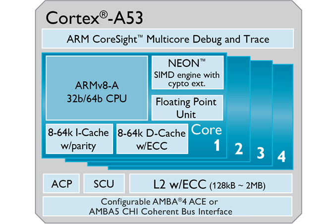
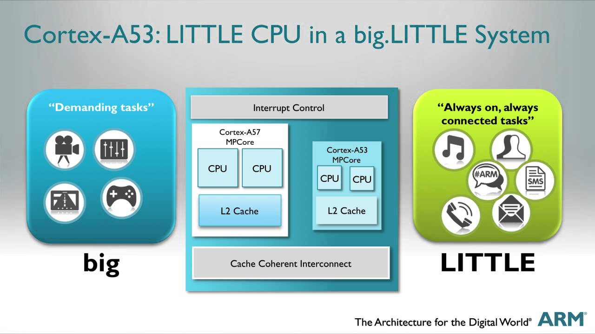

************
Raspberry Pi
************

.. contents::

Board History
*************

The Raspberry Pi was created in Febuary 2012 by the Raspberry Pi Foundation, Oringially setup to promote and teach basic computer science in schools and colleges around the UK. They initially released 2 Devices the Model A and the Model B, these computers ranged in specifications and cabilities. Soon after the release of these products a community was formed and thousands of “Tech-Heads” bought one and started to create new projects with it, for instance one project was to setup a Home Media Centre and play the popular game Minecraft.

The products were so popular due to their low cost (ranging from $25 – $35), their efficiency and durability. This made them easy to modify and create projects.  The device ran Linux, a popular open-source OS for developers.

On the Raspberry Pi website they created 2 images that could be installed easily onto a sd card which would then act as the OS for the device. One of the images was based off of Debian a popular lightweight Linux OS and was called Raspbian, and the other was called Raspbmc and was based off the popular media centre software Kodi (Formally known as XBMC).

In Feburary 2014 they had been reported to have sold 4.5 millions boards, soon after this success they released the Model A+ and Model B+ which provided more GPIO’s and used less power to run. In early 2015 the Raspberry Pi 2 was announced with increased Mhz by 200 to bring it to 900Mhz and doubled the ram to make it 1GB. In early 2016 the Raspberry Pi 3 was released with again increased Mhz (now 1.2 Ghz), on-board WiFi and on-board Bluetooth.

The official Raspberry Pi magazine announced in March of 2017 that over 12.5 million of the affordable little Linux boards have been sold since the original Pi was launched in 2012.

Basic Board Setup
*****************
The Raspberry Pi 3 Model B builds upon the features of its predecessors with a new, faster processor on board to increase its speed. It also features WiFi and Bluetooth Low Energy capabilities to enhance the functionality and the ability to power more powerful devices over the USB ports.

•Quad Core 1.2GHz Broadcom BCM2837 64bit CPU
•1GB RAM
•BCM43438 WiFi and Bluetooth Low Energy (BLE) on board
•40-pin Extended GPIO
•4x USB 2 ports
•4 Pole stereo output and composite video port
•Full size HDMI
•CSI camera port for connecting a Raspberry Pi camera
•DSI display port for connecting a Raspberry Pi touchscreen display
•Micro SD port for loading your operating system and storing data
•Upgraded switched Micro USB power source up to 2.5A
•N.B. For warranty information, please go to www.farnell.com/raspberrypiwarranty

Developement Tools
******************

2.4GHz Wireless Mini Keyboard
Mini Rocker Switch
Jackery Mini 3200mAh Portable Baterry Charger Power Bank
Zumo Chassis Kit
L298N Motor Drive Controller Board
2x 6V 1400RPM Micro Speed Reduction Mort Mini Gear Box Motor
Assorted Wire, Wood, Glue, Screws, etc. to build platform
HC-SR04 Ultrasonic Distance Sensor Module
Breadboard, Compacitors for Sensor

Processor Architecture
**********************
This part name is BCM2837.

This product has ARMv8 Quad Core Cortex A53 Processor @ 1.2 GHz(4x ~2760 DMIPS) functions.

https://developer.arm.com/products/processors/cortex-a/cortex-a53
The Cortex-A53 processor has one to four cores, each with an L1 memory system and a single shared L2 cache. 

Architecture	Armv8-A 
Multicore	1-4x Symmetrical Multiprocessing (SMP) within a single processor cluster, and multiple coherent SMP processor clusters through AMBA 4 technology
 
ISA Support	AArch32 for full backward compatibility with Armv7
		AArch64 for 64-bit support and new architectural features
		TrustZone security technology
		NEON advanced SIMD
		DSP & SIMD extensions
		VFPv4 floating point
		Hardware virtualization support

https://developer.arm.com/products/processors/cortex-a/cortex-a53
Key features	In-order pipeline
		Lower power consumption.
		Extensive dual-issue capability
		Increased peak instruction throughput via dual instruction decode and execution.
		Advanced branch predictor
		Increased branch hit rate with 6Kb Conditional Predictor and 256 entry indirect predictor.
		Extensive power-saving features
		Hierarchical clock gating, power domains, advanced retention modes.

Characteristics

The Cortex-A53 processor delivers significantly more performance than its predecessors at a higher level of power efficiency. This takes the performance of the core above that of the Cortex-A7 processor, which defines many popular mainstream and entry-level mobile platforms. The performance graph to the right shows the performance improvements of the Cortex-A53 processor against the Cortex-A7 processor.

The Armv8-A architecture brings a number of new features. These include 64-bit data processing, extended virtual addressing and a 64-bit general purpose registers. The Cortex-A53 processor is Arm’s first Armv8-A processor aimed at providing power-efficient 64-bit processing. It features an in-order, 8-stage, dual-issue pipeline, and improved integer, NEON, Floating-Point Unit (FPU) and memory performance.

The Cortex-A53 can be implemented in two execution states: AArch32 and AArch64. The AArch64 state gives the Cortex-A53 its ability to execute 64-bit applications, while the AArch32 state allows the processor to execute existing Armv7-A applications.

Processor Assembly Language
***************************
The ARM Cortex-A53 is a microarchitecture implementing the ARMv8-A 64-bit instruction set designed by ARM Holdings.

Demonstration Project
*********************
built robot

Format sd drive
load raspbian noob image
booted sd disk in raspberry pi
load Raspbian Jessie OS
ran update
load build-essential
load git-core
load vim-gtk
ran update
ran upgrade
changed raspberry configuration for keyboard and language (US not UK)
load docker

created robot programs